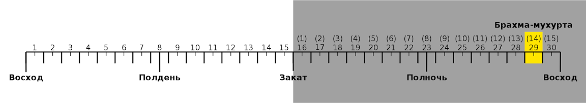

«Аштанга-хридайам-самхита» – канонический трактат по аюрведе – настоятельно рекомендует всем, кто хочет избежать болезней, просыпаться в Брахма-мухурту – определённый период времени до рассвета, когда в природе преобладает саттва-гуна (энергия гармонии, благости). Дополнительный бонус за подъем в Брахма-мухурту – заряд спокойствия и оптимизма.

<!-- more -->

##### Определимся с терминологией

Слово мухурта имеет несколько значений, одно из которых – «48 минут». Почему такая цифра. В ведической традиции сутки считаются от восхода до восхода и делятся на четыре части по 7,5 мухурт в каждой. При равноденствии, в идеальном, так сказать, случае, все мухурты равны 48 минутам.

##### На сколько ставить будильник?

Мне известно два типа мнений по этому поводу. Рами Блект в книге «Три энергии» пишет следующее: «Брахма-мухурта – это предпоследняя, четырнадцатая по счету мухурта темной половины суток. <…> Поэтому Брахма-мухурта всегда начинается за полтора часа [[1]](#_ftn1) до рассвета в данной местности в данное время». Санджай Ратх различает мухурту как «общегражанскую» единицу измерения времени и мухурту, используемую для некоторых астрологических целей: ее величина зависит от того, когда наступает местный восход и закат [[2]](#_ftn2). Эту точку зрения разделяет и Бангалор Венката Раман: «При вычислении мухурты необходимо установить точную длину дня и ночи. Каждая мухурта длится 48 минут (2 гхати) при условии равной продолжительности дня и ночи, т.е. по 30 гхати или 12 часов. Если длина дня 28 гхати, то каждая дневная мухурта будет 1 гхати и 52 вигхати [[3]](#_ftn3)».

Насколько сильно могут отличаться друг от друга «Брахма-мухурта Блекта» и «Брахма-мухурта Ратха – Рамана»? Разберём пример для 22 декабря 2012 года в Москве [[4]](#_ftn4). Закат 21-го случился в 1652, рассвет 22-го – в 959. Следовательно, между ними прошло 17 часов 7 минут. Делим результат на 15, получаем примерно 68 минут. Далее. 68 х 2 = 136 минут или 2 часа 16 минут. 959 — 2 ч 16 мин = 743. Начало «Брахма-мухурты Ратха – Рамана» определили. С «Брахма-мухуртой Блекта» всё просто: 959 — 1 ч 36 мин = 823. Таким образом, разница в продолжительности может составлять до 20 минут, а временной разброс – до 40 минут.

Какую систему расчёта предпочесть – личное дело каждого. Мне же осталось осветить последний вопрос.

##### Чем заняться в Брахма-мухурту?

Брахма-мухурта идеально подходит для изучения священных писаний, медитации, молитвы и других духовных практик.

Вычислять это чудесное время можно каждый вечер самостоятельно, но если вы – обладатель смартфона или планшета на Android’е, то есть и второй вариант: воспользоваться специальным приложением. Насколько мне известно, пока оно такое одно. Брахма-мухурту определяет по методике Ратха – Рамана.

---

[[1]](#_ftnref1) Строго говоря, за 96 минут (48+48), но не суть.

[[2]](#_ftnref2) http://srath.com/jyoti%E1%B9%A3a/muhurta.

[[3]](#_ftnref3) http://astroved1.narod.ru/pb1/MR.htm. См. 5 главу.

[[4]](#_ftnref4) Ночь с 21 на 22 декабря – самая долгая ночь в году. Согласно Ратху и Раману мухурты между закатом 21-го и рассветом 22-го будут максимально продолжительными.