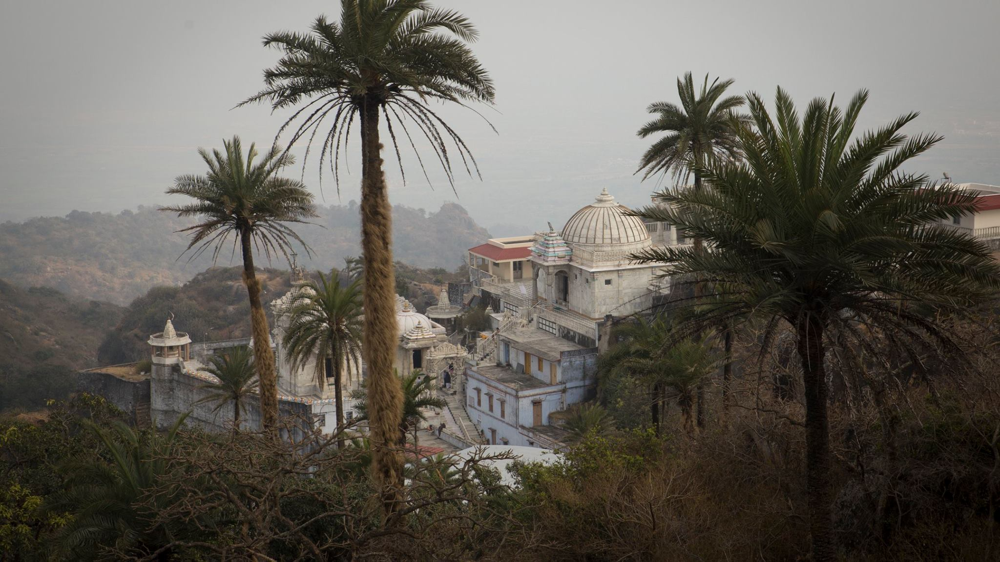

##### Варны и касты

**Юпитер** и **Венера** – брахманы;  	
**Солнце** и **Марс** — кшатрии;  	
**Луна** и **Меркурий** — вайшьи;  
**Сатурн** – шудры;  
**Раху** и **Кету** – млеччхи.  

В современных условиях брахманы — это философы, священники, ученые, академики, учителя, писатели, художники, а также все те, кто в своей деятельности демонстрирует высокую степень вдохновения и альтруистического служения, например врачи или целители. 

<!-- more -->

Кшатриев можно представить себе как политических деятелей, военачальников, служащих полиции и административного аппарата, адвокатов, судей и всех тех, кто определяет и разрабатывает политику общественных объектов всех уровней: компаний, муниципалитетов, стран и т.п. Вайшьи могут быть представлены в качестве членов деловых и торговых общин, торговцев, изготовителей, и т.д. Шудры — люди, задействованные в сфере обслуживания или занятые ручным трудом — не важно, высокой или низкой квалификации. Млеччхи останутся теми, кем они и были всегда: изгоями общества, неудачниками, неспособными найти для себя подходящую нишу в социальной системе. 

_[Отмечу, что «внесистемные» – это не только какие-то криминальные элементы) Это и йогины, отшельники, аскеты, например, – такие маргиналы со знаком плюс) — прим. мое.]_

##### Места

**Солнце** управляет храмами.  
**Луна** управляет такими местами, где много воды.  
**Марс** управляет местами возле огня.  
**Меркурий** управляет местами спортивных состязаний.  
**Венера** управляет местами отдыха и развлечения.  
**Юпитер** управляет «денежными» местами (сокровищница, казна).  
**Сатурн** управляет грязными местами.  

Этот краткий список заимствован из книги Парашары, отца джйотиша. Так как сегодня жизнь более сложно устроена, чем в те отдаленные времена, мы приводим здесь еще один, более современный список мест, управляемых планетами, над которым потрудились много поколений авторов, следовавших за Парашарой:

**Солнце**: открытые пространства, пустыни, дворцы, роскошные здания, правительственные дома, башни, большие залы.  
**Луна**: реки, моря, аквариумы, побережья, доки, колодцы, плавучие дома, баржи и корабли; общественные места, гостиницы, мотели, трактиры, пивоварни, места жительства женщин, больницы.  
**Марс**: кухни, фабрики, где много пользуются огнем и электричеством, механические цеха и мастерские; пожарища, поля битв, места массовой гибели людей, скотобойни и мясные лавки, лаборатории, места агрессивных и утомительных физических состязаний, например боксерские или борцовские ринги, залы для занятия карате, футбольные стадионы; места, постоянно посещаемые рабочими; арсеналы, военные сооружения.  
**Меркурий**: места, связанные с бизнесом, транспортом и связью, в том числе: аэропорты, почтовые и телеграфные отделения, бухгалтерии, места, где занимаются неагрессивными видами спорта, парки, детские площадки, издательства и книжные магазины, библиотеки, места общественных собраний, включая Организацию Объединенных Наций.  
**Юпитер**: банки, хранилища, торжественные места вроде судебных зданий, престижных университетов, места, предназначенные для совершения богослужений, торжественных церемоний, балов, политических ассамблей, благотворительные организации, финансовые учреждения высокого уровня, фондовые и товарные биржи, монастыри и религиозные миссии.  
**Венера**: места развлечений, театры, рестораны, спальни, дома терпимости, места, предназначенные для созерцания красивых вещей: художественные музеи, салоны красоты, модные магазины, торговые центры или пассажи, места, связанные с музыкой: танцевальные залы, музыкальные клубы, оперные театры и концертные залы.  
**Сатурн**: трущобы, сточные канавы, канализационные трубы или коллекторы, мусорные кучи и свалки; места, находящиеся под землей: подвалы, шахты, могилы и склепы, всевозможные труднодоступные места, места уединения пустынников, монашеские обители, тюрьмы, заброшенные, безлюдные и печальные места, кладбища, заброшенные дома, развалины.

Если планеты как таковые представляют собой вышеупомянутые места, то анализ состояния этих планет в гороскопе поможет в выборе более точной интерпретации. К примеру, Сатурн, находящийся в экзальтации, будет означать не просто разрушенный или брошенный дом, а, скорее, величественные руины, наподобие Стоунхенджа, или здание, внесенное в список исторических памятников, тогда как Сатурн в падении укажет на ветхий, запущенный дом, а может быть, на такое место, где нелегально продаются наркотики. Венера в экзальтации может обозначать, например, Карнеги-Холл, а Венера в падении — какое-нибудь «веселое» заведение с сомнительной репутацией. Что будет обозначать Меркурий в бала-авастхе? Возможно, библиотеку начальной школы. А Луна во вриддха-авастхе? Быть может, частный санаторий для пожилых людей, а может быть, интернат для хронически больных?.. Пусть поначалу возможности выбора покажутся вам поистине необъятными, а выбор, в силу этого разнообразия, — затруднительным, но когда вы научитесь интерпретировать значения планет в зависимости от того, какие дома гороскопа ими задействованы, этот выбор значительно сузится.

**Овен** — лес или равнина.  
**Телец** —	поле или луг.  
**Близнецы** — деревня, в доме — спальня.  
**Рак** — водоем или колодец.  
**Лев** — горы или пещеры.  
**Дева** — орошаемая земля; земля, засаженная культурными растениями.  
**Весы** — шумный город или рыночная площадь.  
**Скорпион** — пещера, нора или яма.  
**Стрелец**	— деревни и города; сокровищница или воинский гарнизон.  
**Козерог**	— леса с большим количеством воды.  
**Водолей**	— деревни.  
**Рыбы** — влажные, сырые места.

Данная классификация находит в астрологии множество применений. С ее помощью можно узнать о том, в какого рода местах человек чувствует себя наиболее комфортно; можно отыскивать пропавшие или спрятанные предметы, указывать направления путешествий. Более полный список соответствий составлен по материалам многочисленных астрологических трудов, изданных со времен Парашары.

**Овен**: недавно освоенные земли; места с песчаной почвой, холмистые, заброшенные, нечасто посещаемые или опасные места; печи, горячие цеха и т. п. жаркие помещения; потолки и крыши, а также средние уровни высоты; восточная стена комнаты или здания; месторождения драгоценных камней и полезных ископаемых.  
**Телец**: пастбища и пахотные земли; места проживания фермеров и сельскохозяйственных рабочих; луга, газоны или лужайки; плохо освещенные комнаты с низкими потолками, сараи и чуланы, полуподвалы и цокольные этажи, складские помещения, где хранятся съестные припасы или продукты сельского хозяйства; юго-восточная стена комнаты или дома; места, расположенные на уровне земли или ниже этого уровня.  
**Близнецы**: места игр и развлечений, а также места проживания работников индустрии развлечений; близко расположенные места (до которых можно дойти пешком), соседние дома и участки, примыкающие владения и т. п.; лестничные клетки; галереи, соединяющие соседние здания; улицы, лифты, эскалаторы, классные комнаты и комнаты отдыха; западная стена комнаты или дома; места, расположенные высоко над землей.  
**Рак**: фонтаны, бассейны, каналы, реки, любые естественные или искусственные водоемы, водопроводы, кухни, прачечные, причалы, рестораны; северная стена комнаты или дома; места, расположенные на низком уровне высоты.  
**Лев**: высокие, скалистые места, крутые берега и обрывы; крепости и замки, джунгли, пустыни (труднодоступные и труднопроходимые места); большие парадные залы; места, где царит беспорядок; восточная стена комнаты или дома; места, расположенные на среднем уровне высоты.  
**Дева**: места, часто посещаемые ремесленниками и мастеровыми; места, посещаемые главным образом женщинами; сады, поля, зернохранилища; кладовые, книжные полки или шкафы; помещения, сдаваемые внаем; больничные палаты; южная стена комнаты или здания; уровень земли или ниже земли.  
**Весы**: магазины, рынки, места торговли, ярмарки и выставки товаров; места общего пользования в доме или квартире; кладовые для белья, платяные шкафы; западная стена; большие уровни высоты.  
**Скорпион**: места, кишащие змеями, червями или ядовитыми насекомыми; болота и трясины, нефтяные скважины, стоячие и гниющие воды, выгребные ямы, уборные, сточные канавы и трубы; скрытые или потайные места; северо-восточная стена дома; небольшие уровни высоты.  
**Стрелец**: храмы, резиденции правительства; наследственные владения (дома и поместья), возвышенные, но легко доступные участки земли, большие или высоко расположенные комнаты и залы; сейфы, конюшни и склады боеприпасов, юго-восточная стена здания, средний уровень высоты.  
**Козерог**: трущобы, невозделанные поля, бесплодные участки земли, шахты, горные вершины, утесы, заболоченные леса, неудобные или неиспользуемые комнаты, темные углы или плохо освещенные помещения; южная стена здания; уровень земли или под землей.  
**Водолей**: необычные или особенные места, места проведения научных исследований, склады редкого или уникального оборудования, а также телевизионной и т. п. техники, средств связи; антикварные магазины, помещения, где много антиквариата; северо-западная стена здания; большие уровни высоты.  
**Рыбы**: океаны, моря, побережья, влажные места, места лишения свободы, резервации, тюрьмы, монастыри, больницы; северо-западная стена здания; низкий уровень высоты.

##### Профессии

Лица, в чьих гороскопах факторы, определяющие профессию, находятся под влиянием следующих планет, будут, скорее всего, избирать источником своего существования такие предметы:  
**Солнце**: Плодовые деревья, повторение мантр, мошенничество, азартные игры, нечестные поступки, работа с металлами, шерстью или медицинскими препаратами, а также работа по обслуживанию верховного правителя или иной важной персоны.
**Луна**: Торговля товарами, так или иначе связанными с водой (такими, как жемчуг и коралл, морские водоросли или рыба), продукцией сельского хозяйства и домашним скотом; все, что связано с одеждой и модой; работа, предназначенная для женщин или имеющая какое-то отношение к женскому полу; путешествия; все виды работ, связанные с продуктами питания, с гостиничным и коммунальным хозяйством.  
**Марс**: Металлы (особенно золото), машины и механизмы; различные виды деятельности, имеющие отношение к мужчинам и мужскому полу; война и все, что с нею связано; профессии, связанные с высокой температурой (повар, пожарный), а также с электричеством и энергетикой; профессии, связанные с использованием острых предметов (мясники, хирурги и др.); работа в сфере недвижимости; различные виды деятельности, связанные с оружием, с опасностью, профессии, требующие смелых, решительных действий; кроме того, такие люди склонны иметь дело и вступать в контакты с плохими людьми, шпионами и ворами.  
**Меркурий**: Астрология, поэзия, риторика и красноречие, учеба, письмо (писание книг или конторская работа), обучение, постижение священного знания, повторение мантр, использование чисел; возможно, мошенничество, плагиат, подделка денег и документов или иной обман; различные виды ремесел и другие занятия, для которых необходима ловкость рук.  
**Юпитер**: Религия и религиозное наставничество, преподавание и духовная проповедь, работа с детьми, консультативная деятельность, философия, закон и юриспруденция; декламация и изучение священных текстов либо их составление; ростовщичество, благотворительность, обращение за помощью к мудрецам, богам или властям.  
**Венера**: Женщины (как и в случае Луны); коровы, лошади и другие крупные животные; различные виды искусств; романтические, любовные похождения; работа с серебром; деликатесы, изысканные вещи, украшения и наряды; поэзия; советы и консультации; под влиянием Венеры находятся модельеры и декораторы.  
**Сатурн**: Торговля корнями (корнеплодами и т. п.) и плодами растений, тяжелый физический труд, переноска тяжестей, работа, так или иначе связанная со слугами, нищими и бездомными, другими людьми низших классов; работа, сбор и переработка старых вещей, испорченных продуктов; обработка камня и дерева, скульптура; всякие низкие, непочтенные профессии; такие как мясник, палач или похоронных дел мастер; работа под землей или с материалами, добываемыми из-под земли.  
**Раху** и **Кету**: Раху проявляет себя подобно Сатурну, а Кету — подобно Марсу. Кроме того, они указывают на профессии, требующие ловкости рук, манипуляции,как, например, профессия фокусника, на деятельность, связанную с иммиграцией, с чужими странами или языками; с ядами, алкоголем и другими вредными веществами; на участие в деятельности, вовлекающей широкие массы людей. Далее, Раху может указывать на причастность к оккультному знанию, занятию паранормальными явлениями, тогда как Кету имеет отношение к духовным исканиям.

##### Цветы, деревья и продукты питания
##### 
**Солнце** управляет красным лотосом, пшеницей и сильными, массивными деревьями.  
Под управлением **Луны** находятся лилия, рис и любые растения, содержащие большое количество масел или сока.  
Под управлением **Марса** — красные цветы, красная чечевица, а также мощные деревья, нередко имеющие шипы.  
К **Меркурию** относятся лиственные растения, к нему относятся бобы «мунг», а также деревья, не дающие плодов.  
**Юпитер** управляет жасмином, бенгальским горошком и деревьями, приносящими плоды.  
**Венера** управляет белым лотосом, бобами и красиво цветущими деревьями.  
Под управлением **Сатурна** находятся фиалка, семена кунжута, а также бесполезные или уродливые деревья.

**Солнце**. Громадные деревья, редкие или дорогие разновидности древесины, сосна, строевой лес, апельсиновые деревья, кедр, миндаль, ромашка, лаванда, розмарин, шафран, лекарственные и ароматические травы, большие и заметные цветы желтого цвета, все виды перца, мускатный орех, кардамон, индийская трава аджван, тонкие вина и изысканные ликеры.  
**Луна**. Различные водные растения и растения, расцветающие по ночам, рис, дыня, кокос, пальмовое дерево, обыкновенные фрукты и овощи, огурцы, молоко и молочные продукты, кукуруза, мак, приправы, имеющие мягкий вкус, простая вода, пиво, все то, что тушится или приготовляется на пару, вообще всякая пища, подвергнутая кулинарной обработке, вода, охлажденные продукты, почти все очень сочные и мягкие фрукты или овощи.  
**Марс**. Все виды колючих кустарников и сорных растений, жгучая крапива, ядовитый плющ и дуб, все острые приправы, перец, горчица, кориандр, чеснок, конопля, кофе, чай, крепкие спиртные напитки, растения и пищевые продукты с сильным запахом, пищевые продукты, богатые белком (в частности, мясо), пища, возбуждающая страсти, различные стимуляторы.  
**Меркурий**. Мелкие растения, дикорастущие цветы, всевозможные корни, используемые в пищу непосредственно или в качестве специй, «пиво», приготовляемое из корнеплодов по особой рецептуре, морковь, пастернак, бамия, нектарин (гладкий персик), фрукты и овощи, полученные путем прививки или гибридизации, подобно плоду танджело.  
**Юпитер**. Жирная, но чистая пища, сливочное или топленое масло, сливки, тыква, природно-сладкая пища, ягоды, фруктовые соки, сахарный тростник, финики, мед, оливковое масло, фруктовые деревья, сладкие травы, перечная мята, курчавая (зеленая) мята, сладкие вина.  
**Венера**. Хлопок, шелк, все причудливые или экзотические овощи, фрукты и ягоды, гранат, крыжовник, фруктовые соки, которые от природы являются сладкими или кислыми, очищенные сладкие вещества, белый сахар, глюкоза, ароматные цветы и деревья, сандаловое дерево, духи, садовые цветы, ползучие и вьющиеся растения (такие, как виноградная лоза), конфеты и карамель, сладкие ликеры, восточные специи, простая пища, прошедшая обработку, — хлеб, мука и т.п.  
**Сатурн**. Трудноперевариваемая пища, бобовые, люцерна, клевер, горох, арахис, соевые бобы, темноокрашенные продукты, рожь, грубая или некачественная, старая, лежалая, нечистая или гнилая пища, горькие травы и коренья, соль, сквашенные или маринованные продукты, уксус, сухие вина, сорные растения, чужеземная пища.

Многие продукты могут управляться одновременно несколькими планетами. Мороженое, например, как холодный молочный продукт относится к сфере управления Луны, как сладость, содержащая большое количество очищенного сахара, — к сфере Венеры, и как нестоящая, негодная пища («мороженое — это не еда», как его оценивают многие люди) частично управляется Сатурном. Тому, кто не знаком с принципом планетного управления во всех его проявлениях, такое тройное управление может показаться непонятным или противоречивым, но читатель, прочно усвоивший основополагающие свойства вещей, символизируемые грахами, увидит во всяком подобном случае не противоречие, а обычное и хорошо знакомое ему явление взаимно пересекающихся планетных влияний.

_Информация взята из книги «Джйотиш. Введение в индийскую астрологию» Харта Дефау и Роберта Свободы. Серьезную работу по сбору данных авторы провели, спасибо им большое.
_

