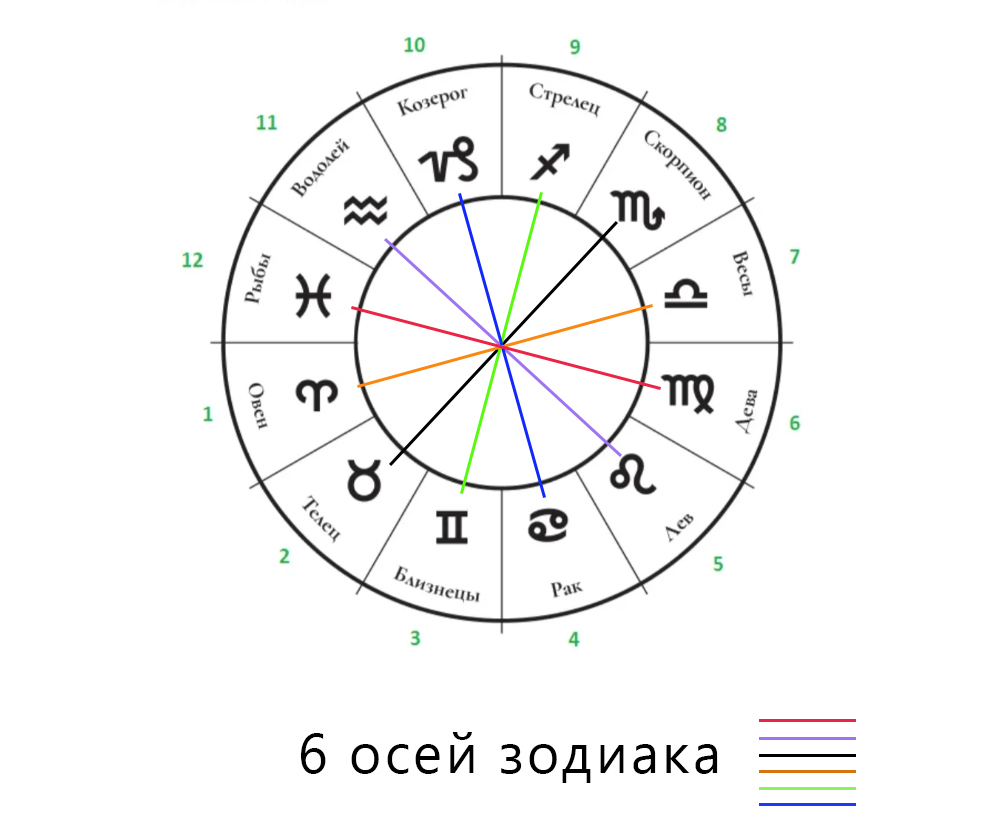
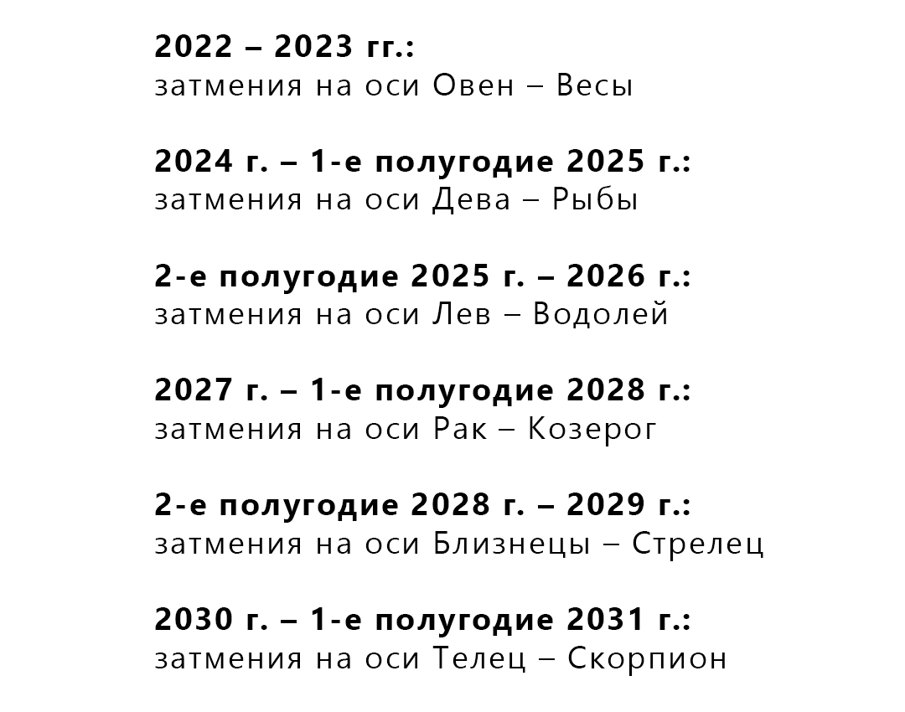

Трактовать затмения в личных целях – легко! Вы можете сами определять важнейшие потенциальные проблемы и ставить задачи по их предупреждению. Надо всего лишь… запомнить ключевые характеристики осей зодиака. А теперь по порядку)

<!-- more -->

Каждое затмение имеет 2 стороны – уникальную и типичную. Уникальную («В этот раз затмение совпадает с ретроградным Меркурием и соединением Марса с Сатурном, поэтому…») оставьте специалистам. Особенности и учитывающие их детальные прогнозы – это полезно и круто, но за деталями легко потерять суть и в итоге не позаботиться о главном. О главном рассказывает типичная сторона затмения – характеристики знака зодиака, в котором оно происходит. 

Плавно переходим от знаков к осям.

Затмения приходят не поодиночке, а двойками или тройками с промежутком примерно в две недели, причем – в противоположных знаках, дополняющих друг друга подобно половинкам инь-ян: если произошло солнечное затмение во Льве, значит 14 дней спустя будет лунное затмение в Водолее.

О противоположных знаках говорят, что они лежат на одной оси (поэтому говорят, что затмения происходят на оси такой-то). Всего осей 6: Овен – Весы, Телец – Скорпион и т. д. 

У каждой оси, каждого «ин-янь», есть несколько основных идей. Знаки оси показывают их с разных сторон. Например, есть ось, чьи идеи в основном связаны с ресурсами – это ось Телец – Скорпион. (Кстати, именно она будет задействована при ближайшем затмении – 4.12.2021.) Телец, если коротко, символизирует личные, явные ресурсы, а Скорпион – ресурсы партнеров или совместные ресурсы, ресурсы чужие и скрытые. 

Идеи оси, на которой происходят затмения, требуют внимания, т. к. затмения маркируют потенциальные кризисы – переходные состояния, вскрывающие, что привычный образ жизни, поведения теряет эффективность или что жить по-старому вообще больше не получится.

Скажем, затмения на вышеупомянутой оси Телец – Скорпион (оси ресурсов и еще удовольствий) предупреждают о том, что модель взаимодействия с ресурсами и удовольствиями пора пересмотреть, улучшить. Проверочные вопросы в этом случае примерно такие: устраивает ли меня мой доход / сексуальная жизнь с партнером? Разумно ли организованы траты / вложения средств? Как у меня / у нас с партнером с финансовой грамотностью? Вопросы для остальных осей легко составить по аналогии. (Предстоит затмение на оси Лев – Водолей = стоит оценить, насколько эффективно мои уникальные продукты, идеи и пр. представлены в обществе? не пора ли выходить на новый уровень общественного служения, отдачи миру своих талантов? (с сопутствующим ростом ответственности, да, но и доходов, прибыли).)

**Затмения побуждают нас быть проактивными и осознанными!** А еще целостными, так как приучают находить баланс в разных сферах жизни.

Вишенка на торте. Затмения «привязаны» к Раху и Кету: как правило, они происходят в знаках той же оси, на которой лунные узлы располагаются в данной момент. Движение Раху – Кету циклично и предсказуемо, оно просчитывается компьютерными программами, так что **уже сейчас** мы имеем доступ к расписанию вызовов Вселенной на годы вперед! Мы **уже** знаем, за что с нас спросят. Да, внешние условия могут сильно меняться, могут возникать новые возможности или проблемы, но если вы системно работаете над какой-то осью, ее сферами, то будете лучше готовы к переменам, сможете быстрее адаптироваться.

## Краткие характеристики осей.

Базовые характеристики знака во многом определяются планетой, которая им управляет. Я указала управителей знаков в скобках, чтобы вам было проще строить свои цепочки рассуждений.

**Овен – Весы (Марс – Венера). Ось отношений.**

Полюса оси:
* я – партнер (по браку, бизнесу и т. д.);
* я – другой/другие;
* мое физическое тело – тело другого;
* мои границы – границы другого;
* мои действия, инициативы – действия другого или наши совместные действия, компромиссы. 

**Телец – Скорпион (Венера – Марс). Ось ресурсов, или Ось отношений через призму ресурсов и удовольствий.**

* Полюса оси:
* мои ресурсы (время, деньги, знания и пр.) – ресурсы партнера или наши совместные ресурсы;
* мои ценности – ценности партнера;
* моя самооценка – самооценка партнера;
* мои вкусы, понятия об удовольствии – вкусы и представления об удовольствии партнера;
* явные ресурсы – скрытые ресурсы.

**Близнецы – Стрелец (Меркурий – Юпитер). Ось знаний, перемещений и коммуникации.**

Полюса оси:
* практические навыки, информация, факты – система знания, мудрость, абстрактное знание, философия, теория, этика, закон, мировоззрение, религия;
* распространение, популяризация знания, информации – само знание, создание системы знания;
* братья/сестры, соседи, люди моего же уровня – учителя, Гуру, люди в авторитетной (по отношению ко мне) позиции;
* коммуникация по горизонтали – коммуникация по вертикали;
* короткие поездки – длительные поездки или поездки на далекие расстояние,
* заграничные путешествия, паломничества.

**Рак – Козерог (Луна – Сатурн). Социальная ось.**

Полюса оси:
* дом – социум;
* интимное, личное, внутреннее пространство, чувства и эмоции – открытое, общественное пространство, правила поведения;
* комфорт, защищенность – отсутствие гарантированной безопасности;
* отдых, досуг – карьера. 

**Лев – Водолей (Солнце – Сатурн). Ось творчества.**

Полюса оси:
* яркое проявление индивидуальности, уникальность – коллективизм, массовые решения;
* личное творчество (принесение в мир чего-то нового), изобретения, дети – коллективное творчество, передовые наукоемкие технологии (подразумевающие согласованные усилия многих людей и/или необходимость промышленного оборудования и пр.), жизнь/продвижение личного творчества в социуме, соцсети, общественное признание;
* центр – периферия, система в целом и связи в ней. 

**Дева – Рыбы (Меркурий – Юпитер). Ось служения.**

Полюса оси:
* детали, анализ, конкретика – общий план, синтез, символы;
* рутинная, нудная работа, ремесло, проза жизни, земная правда – воображение, фантазия, уход от реальности, изоляция от мира, благотворительность, филантропия, йога, уединенная духовная практика, вечные ценности, мокша;
* исцеление на физическом уровне – исцеление на духовном уровне, холистическая медицина;
* локальное решение проблем – решение проблем на самом общем (в частности, теоретическом, мировоззренческом) / мировом уровне.

## Расписание вызовов Вселенной на ближайшие 10 лет.

На самой 1-й иллюстрации – картина «Затмение» (1980 г.) Руфино Тамайо, мексиканского художника-модерниста.
