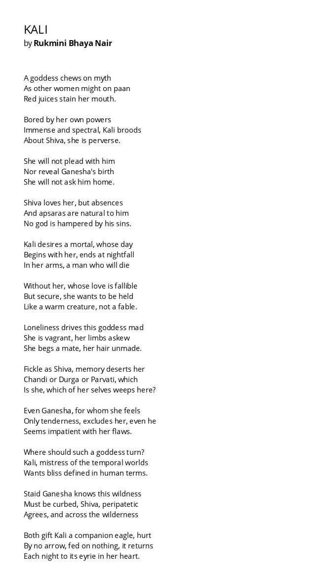

В 1990 году это стихотворение получило первую премию на Втором Всеиндийском поэтическом конкурсе и рассматривается критиками как жемчужина современной индийской поэзии. Не нашла переложение на русский, так что в роли переводчиков выступили я и Google Translate. Оригинал на картинке в конце статьи: в нашей версии не будет таких прекрасных перекличек в окончаниях строк (myth – mouth, powers – perverse, absences – sins, hurt – heart и т. д.). Мне нравится, как эхо-подобие работает на идею отражения, двойственности, «взаимодействия эзотерического с мирским».

<!-- more -->

Такое взаимодействие вызывает в памяти «Сита поёт блюз», но это не самое важное, конечно. Чем прекрасны стихи: каждый извлекает свой смысл. Для меня здесь много от лирики бхактов и побуждение бхакты совершенствовать свою бхакти к Дэви.

## Кали

Богиня жует миф,  
Как иная женщина – паан.  
Соки багрят её рот.  

Утомленная собственной мощью,  
Безмерной и призрачной, Кали  
Носит мысли о Шиве, она перверсивна.  

Не будет просить его,  
Не раскроет рожденье Ганеши  
И не позовет домой.  

Шива любит ее, но отлучки  
И апсары ему естественны.  
Ни одному богу не мешают его грехи.  

Кали желает смертного, чей день  
Начинается с нее, заканчивается с наступлением темноты  
В ее объятиях. Мужчину, который умрёт  

Без неё, чья любовь несовершенна  
Но надежна, она хочет, чтобы ее держали  
За теплое существо, а не байку.  

Одиночество сводит богиню с ума.  
Она – бродяга, конечности кривы.  
Она молит о спутнике, волосы спутаны.  

Непостоянная, как Шива, память покидает её.  
Чанди ли, Дурга, или Парвати – кто она?  
Которое Я здесь плачет?  

Даже Ганеша, к которому она чувствует  
Только нежность, исключает ее, даже он,  
Кажется, не терпим к её недостаткам.  

Куда обратиться такой богине?  
Кали, владычица временных миров,  
Хочет блаженства в людском понимании.  

Степенный Ганеша знает, что дикость  
Эта должна быть обуздана. Шива-странник  
Согласен. Сквозь дебри  

Оба дарят Кали орла-компаньона:  
Не вредят ему стрелы, ничем не питается  
И каждую ночь к гнезду в ее сердце  
Он возвращается.  

