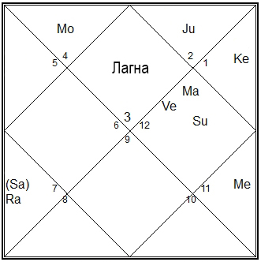

Гороскоп, по форме своей, – образец минималистичной инфографики) Что же он отображает?
Во-первых – положение [9 планет](http://nathas.org/dictionary/navagraha/) в момент вашего рождения относительно места рождения. Во-вторых, и одновременно, различные сферы человеческой жизни, аспекты личности. Эти сферы и аспекты группируются по числу знаков зодиака в 12 «домов».

Сопоставляя характеристики домов, знаков и планет, плюс набор всяких правил и техник :), астролог делает заключение о том, как обстоит / будет обстоять дело в той или иной области.

<!-- more -->

В североиндийском способе начертания гороскопа, к которому я привыкла, дома визуализируются в виде квадратов и треугольников. 

Цифры – порядковые номера созвездий (1 – Овен, 2 – Телец ... ), латинские буквы – сокращенные названия грах (планет).

##### Основные значения 12 домов гороскопа

1-й (он же "лагна"). Голова и лицо, внешний вид, телосложение, все, что относится к телу, жизнь, поведение, характер, здоровье.

2-й. Лицо и горло, правый глаз, рот, способность говорить, индивидуальные особенности речи, еда и питье, продовольствие, богатство вообще, и особенно движимое имущество, накопленные деньги, ликвидные активы (в банковском деле), семья, род.

3-й. Руки, плечи и шея, слух, общение (в основном, повседневное), письмо и письменная коммуникация, младшие братья и сестры, физические и умственные способности или умения, туризм, короткие поездки, путешствия  на близкие расстояния, смелость, отвага.

4-й. Грудь, грудная клетка, мать, дома и сооружения, недвижимое имущество, транспортные средства, чувства и эмоции, счастье, образование, воспитание.

5-й. Совет и совещание, живот (верхняя часть живота и помещающиеся там органы, в том числе желудок и печень), дети, проницательность и способность различения хорошего и плохого.

6-й. Несчастные случаи, заботы и тревоги, долги, болезни, враги, судебные процессы, кража (воровство), тетя или дядя со стороны матери, средняя часть живота и размещенные там органы, в особенности тонкий кишечник; обслуживание кого-либо как повседневная обязанность, подчиненные.

7-й. Муж или жена, партнеры по бизнесу, нижняя часть живота и расположенные там органы.

8-й. Трансформация, смерть, несчастные случаи, банкротство, судебные процессы, наследственность, наружные половые органы, органы выделения (включая толстый кишечник), тайны, мистика, оккультизм, энергия Кундалини.

9-й. Удача, отец, Гуру, религия, стремление к божественной мудрости, паломничество, длительная поездка, путешествие на дальнее расстояние, бедра, верхние части ног.

10-й. Карьера, общественное положение, статус, достижения, колени.

11-й. Старший брат или сестра; желания, стремления, прибыли и заработки, собственный бизнес, подарки, влиятельные друзья, средняя часть ног (голени и лодыжки).

12-й. [Мокша](http://nathas.org/dictionary/moksha/), йога, сон, секс, тюремное заключение, изоляция, конец чего-либо, расходы, проживание за рубежом, иммиграция, потери (включая потерю физических сил и энергии), ступни.

Для построения гороскопа необходимы следующие данные: дата, время и место рождения. Если время не известно – не беда, его можно вычислить.